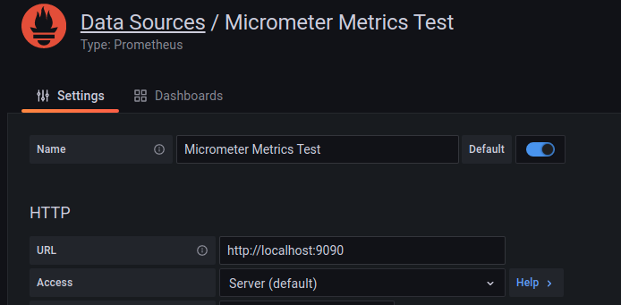

# MicrometerMetrics
Projeto testes de geração de métricas.

## Tecnologias
- Java 11
- Lombok
- Spring Boot 2.5.4
- Open API
- Micrometer
- Prometheus
- Docker
- MongoDB

## Executando a aplicação
Executar as dependências:
``` bash
docker-compose up -d
```
Executar a aplicação:
``` bash
./gradlew bootRun
```

## URLs expostas pela aplicação e dependências
- Doc da aplicação:
  - http://localhost:8080/v3/api-docs
  - http://localhost:8080/swagger-ui
- Prometheus:
  - http://localhost:9090
- Grafana:
  - http://localhost:3000
    - Usuário e senha padrão: admin/admin
- Serviços da aplicação:
  - GET http://localhost:8080/sample
  - POST http://localhost:8080/sample
  - GET http://localhost:8080/sample/property [Redirect: /sample/asset]
  - GET http://localhost:8080/sample/asset [Internal Server Error 500]

## Configurando o Grafana
1) Acessar o grafana pelo navegador com a url: http://localhost:3000
2) Efetuar o login com o usuário e senha padrão: admin / admin
3) Configurar o data source para o prometheus:

4) Importar um dashboard 

### Alguns Dashboards
[JVM (Micrometer)](https://grafana.com/grafana/dashboards/4701)   
[Spring Boot Statistics](https://grafana.com/grafana/dashboards/6756)
[Custom Dashboard](./src/main/resources/grafana/CustomDashboard.json)

## Roadmap
- Monitorar Spring Feign Client
### WIP
- Monitorar Spring Cloud Stream
- Gerar dados de monitoração customizados

# Referências
- https://medium.com/projuristech/monitorando-uma-aplica%C3%A7%C3%A3o-spring-boot-2-x-cef826ae793c
- https://www.baeldung.com/micrometer
- https://www.mokkapps.de/blog/monitoring-spring-boot-application-with-micrometer-prometheus-and-grafana-using-custom-metrics/
- https://prometheus.io/docs/prometheus/latest/querying/examples/
- https://cloud.spring.io/spring-cloud-stream/reference/html/spring-cloud-stream.html
